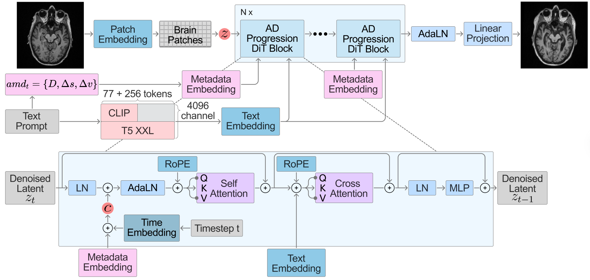

<p align="center">
  
  <br><br>
  <font size="5"><b>Health &amp; Artificial Intelligence Lab</b></font>
</p>

# ADP-DiT: Text-Guided Diffusion Transformer for Brain Image Generation in Alzheimer's Disease Progression

## 🔥 News

- **April 15, 2026**: 🎉 Code released.
- **April 1, 2026**: 🎉 Accepted to ICPR 2026.

---

## 🧠 Overview

<p align="center">
  
</p>

ADP-DiT is an **interval-aware, clinically text-conditioned Diffusion Transformer** for longitudinal Alzheimer's Disease (AD) MRI synthesis. It encodes follow-up interval together with multi-domain demographic, diagnostic (CN/MCI/AD), and neuropsychological information as a natural-language prompt, enabling time-specific control over synthesized follow-up scans.

**Key features:**
- **Dual text encoders**: OpenCLIP for vision–language alignment and T5 for richer clinical-language understanding, fused into DiT via cross-attention and adaptive layer normalization.
- **Anatomical fidelity**: Rotary positional embeddings on image tokens and diffusion in a pretrained SDXL-VAE latent space for efficient high-resolution reconstruction.
- **Clinical controllability**: Subject-specific conditioning on follow-up time interval, age, sex, diagnosis stage, and neuropsychological scores via natural-language prompts.

**Results**

| Metric | ADP-DiT | DiT Baseline | Improvement |
|:---:|:---:|:---:|:---:|
| SSIM | **0.8739** | 0.7652 | +0.1087 |
| PSNR (dB) | **29.32** | 23.24 | +6.08 dB |

---

## ⚙️ Environment

- Ubuntu 22.04 LTS
- CUDA 12.1
- Python 3.8

---

## 🛠️ Setup

#### 1. Clone the repository

```shell
git clone https://github.com/labhai/ADP-DiT.git
cd ADP-DiT
```

#### 2. Set up a Python virtual environment

```shell
# Install Python 3.8 (if not already installed)
sudo apt update && sudo apt install python3.8 python3.8-venv python3.8-dev

# Create and activate virtual environment
python3.8 -m venv venv
source venv/bin/activate

# Install dependencies
pip install -r requirements.txt

# Install IndexKits (data management library)
pip install -e ./IndexKits

# Install FlashAttention for faster training (requires CUDA 12.4+)
pip install flash-attn --no-build-isolation
```

---

## 📦 Pretrained Models

Install the Hugging Face CLI to download pretrained models:

```shell
pip install "huggingface_hub[cli]"
```

Download each component into `./ckpts/t2i/`:

| Model | #Params | Hugging Face |
|---|---|---|
| CLIP-G (ViT-bigG/14) | ~2.5B | [Download](https://huggingface.co/laion/CLIP-ViT-bigG-14-laion2B-39B-b160k) |
| CLIP Text Encoder | ~632M | [Download](https://huggingface.co/laion/CLIP-ViT-bigG-14-laion2B-39B-b160k) |
| CLIP Tokenizer | — | [Download](https://huggingface.co/laion/CLIP-ViT-bigG-14-laion2B-39B-b160k) |
| T5 (v1.1-XXL) | ~11B | [Download](https://huggingface.co/google/t5-v1_1-xxl) |
| SDXL VAE (fp16-fix) | ~84M | [Download](https://huggingface.co/madebyollin/sdxl-vae-fp16-fix) |

The expected checkpoint directory structure is:

```
ckpts/
└── t2i/
    ├── clip-g/
    ├── clip_text_encoder/
    ├── tokenizer/
    ├── T5/
    └── sdxl-vae-fp16-fix/
```

> **Note:** If a download is interrupted, rerunning the `huggingface-cli` command will resume from where it left off.

---

## 📂 Data Preparation

1. **Prepare directories**

   ```shell
   mkdir -p ./dataset/AD_meta/arrows ./dataset/AD_meta/jsons
   ```

2. **Convert CSV to Arrow format**

   ```shell
   python ./adpdit/data_loader/csv2arrow.py \
     ./dataset/AD_meta/csvfile/image_text.csv \
     ./dataset/AD_meta/arrows \
     1
   ```

3. **Build training index**

   ```shell
   python IndexKits/bin/idk base \
     -c dataset/yamls/AD_meta.yaml \
     -t dataset/AD_meta/jsons/AD_meta.json
   ```

   For advanced data configuration options (filtering, deduplication, etc.), see [IndexKits documentation](./IndexKits/docs/MakeDataset.md).

The expected dataset directory structure is:

```
dataset/
└── AD_meta/
    ├── arrows/          # Arrow files for training
    │   ├── 00000.arrow
    │   └── ...
    ├── csvfile/         # CSV metadata
    │   └── image_text.csv
    ├── images/          # PNG brain slices
    │   ├── 000000_2025-01-01_165.png
    │   └── ...
    └── jsons/           # Index files used during training
        ├── AD_meta.json
        └── AD_meta_stats.txt
```

---

## 🚀 Training

```shell
export PYTHONPATH=./IndexKits:$PYTHONPATH
bash ./adpdit/train_cosine_restarts.sh
```

Monitor training progress with TensorBoard:

```shell
tensorboard --logdir ./log_EXP_dit_g_2_AD_meta_cosine_restarts/<run-dir>/tensorboard_logs \
  --bind_all --port 6006
```

---

## 🔍 Inference

Run inference on a single image:

```shell
python sample_t2i.py \
  --model-root ./ckpts \
  --dit-weight ./log_EXP_dit_g_2_AD_meta_cosine_restarts/<run-dir>/checkpoints/latest.pt \
  --image-path ./dataset/AD_meta/images/000000_2025-01-01_165.png \
  --prompt "Alzheimer's Disease, Female, 72 years old, 7 months from first visit" \
  --results-dir ./results/sample_inference \
  --infer-mode torch \
  --sampler dpmpp_2m_karras \
  --infer-steps 30 \
  --cfg-scale 6 \
  --strength 0.1 \
  --image-size 256 256
```

---

## 📊 Evaluation

Run evaluation on the full test set (multi-GPU):

```shell
numactl --interleave=all \
python -m adpdit.evaluate_test_csv \
  --test-csv ./dataset/AD_meta/csvfile/test.csv \
  --checkpoint ./log_EXP_dit_g_2_AD_meta_cosine_restarts/<run-dir>/checkpoints/latest.pt \
  --output-csv ./results/evaluation/test_results.csv \
  --output-dir ./results/evaluation \
  --save-images \
  --save-comparisons \
  --num-gpus 8 \
  --batch-size 2 \
  --infer-steps 30 \
  --cfg-scale 6 \
  --strength 0.1 \
  --sampler dpmpp_2m_karras
```

---

## 📖 BibTeX

If you find this work useful, please cite:

```bibtex
@inproceedings{lee2026adpdit,
  title     = {ADP-DiT: Text-Guided Diffusion Transformer for Brain Image Generation in Alzheimer's Disease Progression},
  author    = {Lee, Juneyong and Baek, Geonwoo and Jang, Ikbeom},
  booktitle = {Proceedings of the International Conference on Pattern Recognition (ICPR)},
  year      = {2026},
}
```
